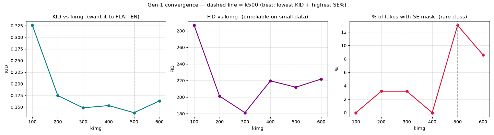
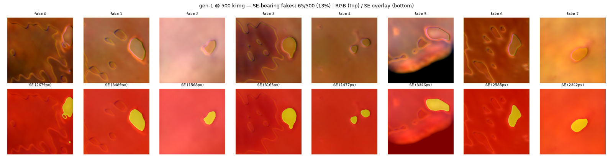
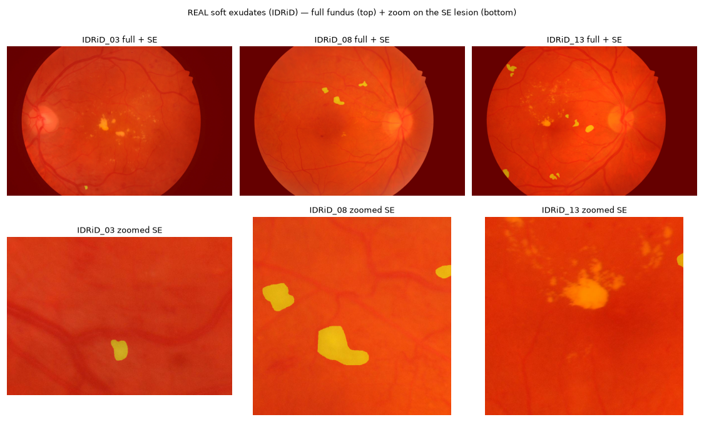

# Gen-1 Convergence Run — Results

_Retina MAD study, Run A pilot. Goal: find the kimg where gen-1 is trustworthy (KID flat + SE masks
real) before locking it for the recursion. Trained ONE generator on the REAL patches to 600 kimg,
scored each checkpoint. Data: 44 train images → 4,400 patches (SE present in only 23/44 images)._

Open in VS Code with **Markdown Preview** (Ctrl+Shift+V) to see the embedded images.

---

## Per-checkpoint numbers

| kimg | FID | KID | SE in fakes | mean SE area (px) |
|-----:|----:|----:|:-----------:|------------------:|
| 100 | 286.7 | 0.3257 | 0 % | 0 |
| 200 | 201.2 | 0.1749 | 3 % | 4395 |
| 300 | 181.2 | 0.1484 | 3 % | 4432 |
| 400 | 219.7 | 0.1533 | 0 % | 0 |
| 500 | 211.9 | **0.1380** | **13 %** | 2502 |
| 600 | 221.8 | 0.1633 | 9 % | 3874 |

_(FID is unreliable on this little data — ignore it; KID + SE% + the montages are the real signals.)_

_KID drops then flattens after ~300 kimg (converged); FID bounces (ignore); SE% is erratic and peaks
at k500 (dashed line = the chosen lock point)._

---

## Reading the numbers

- **Overall quality (KID) plateaus by ~300 kimg** — 0.148 → 0.153 → 0.138 → 0.163, just wobbling
  after 300. So the *images* converge around 300–500 kimg.
- **The rare class (SE) is weak and erratic** — 0 % → 3 % → 0 % → **13 %** → 9 %. Even at its best
  (k500) only ~1 in 8 fakes contains soft exudate, and it swings checkpoint-to-checkpoint.
- **Best checkpoint = k500**: lowest KID (0.138) and highest SE prevalence (13 %).

---

## The SE masks it DID produce (k=500)

Top row = generated RGB retina patches; bottom = same with the SE mask (yellow). The masks are
**coherent blobs sitting on bright yellow lesions** — the image↔mask link is correct. But they are
**single, smooth, uniform ovals**.

## What REAL soft exudates look like (IDRiD)

Real SE are **small, irregular, sometimes fluffy/clustered** cotton-wool patches with soft edges
(see IDRiD_13). The GAN captured the *gist* ("pale-yellow lesion + correct mask") but not the
texture or variety.

---

## Conclusion

**The bottleneck is data scarcity, not a bug or undertraining.** With SE in only 23 images (and tiny
area within them), the GAN learned a **simplified caricature** of soft exudate. More kimg won't add
texture it never had examples of. The image↔mask correspondence IS correct, so the fakes are usable
for watching *relative* collapse — just with modest absolute SE quality.

**Important reframe:** SE is only 1 of 4 lesion classes. The other three are well-represented and
will be clean:

| Class | patches containing it (of 4400) | |
|-------|-------------------------------:|---|
| MA | 2897 (~66 %) | common |
| HE | 2885 (~66 %) | common |
| EX | 2672 (~61 %) | common |
| **SE** | **685 (~16 %)** | **rare — the canary** |

The finding lives in **all four per-class curves together** (which class collapses first), not in SE
alone. SE's weakness is itself a legitimate data point.

---

## Decision / next steps

- **Lock KIMG ≈ 500** (best KID + SE), **reuse this gen-1** checkpoint
  (`runs_pilot/gen1_convergence/checkpoints/kimg00500.pt`) as the recursion's gen-1 → saves ~10 h.
- Run **gens 2–3 first** (Run A), plotting **all four per-class curves**, then extend to gen 4 if the
  lines are diverging. ~10 h per new generation on this card (7-channel @256px, ~70 s/kimg).
- **Optional polish** (only if SE turns out to be the key mover): add **SE-priority patching**
  (oversample the 23 SE images) to raise SE prevalence/texture — attacks the scarcity directly.

### All output files
- Numbers: `results_pilot/gen1_convergence.csv`
- SE montages per checkpoint: `results_pilot/se_montage_k00100.png … k00600.png`
- Real SE reference: `results_pilot/REAL_se_examples.png`
- Checkpoints: `runs_pilot/gen1_convergence/checkpoints/kimg00100.pt … kimg00600.pt`

---

# FINAL VERDICT — Gen-1 Probe Gate → IDRiD is too small → PIVOT to BraTS

_2026-07-14. Reused the converged gen-1 (k500), generated 5,000 fakes, trained a U-Net on them, and
scored on the LOCKED real test set. Compared to a U-Net trained on REAL patches (topline)._

| Class | real→real (topline) | **fake→real (gen-1 k500)** |
|-------|--------------------:|---------------------------:|
| MA | 0.400 | **0.0005** |
| HE | 0.300 | **0.0002** |
| EX | 0.661 | **0.270** |
| SE | 0.373 | **0.000** |
| **mean** | **0.434** | **0.068** |
| SE recall | 0.467 | **0.000** |

**Gate: gen1/real = 0.16×** (needed ≥ 0.80) → **HARD FAIL.**

### What it means
- **Not an SE-only problem — a global one.** 3 of 4 classes transfer at ~zero; only **EX** (biggest,
  brightest lesion) partly survives (0.27). Fine/small lesions (MA, HE, SE) → gone.
- **Pipeline is sound** — the real topline works (0.43, normal for IDRiD), and the fake-trained U-Net
  fit its fakes fine (loss → 0.11). So this is **not a bug**.
- **Root cause: 44 images can't teach realistic lesion morphology.** The fakes are blobby/oversized,
  so a U-Net trained on them fires ~nothing on real tiny/irregular lesions. SE-oversampling would NOT
  fix it (MA/HE also died — it's total data volume, not rare-class-specific).

### Decision
IDRiD is **too small** for the synthetic-recursion MAD study. This is a clean, useful **negative
result** (rare + fine lesions don't survive at 44 images), but not the dataset to run the study on.

**PIVOT → BraTS 2020 multi-class** (WT / TC / **ET**=rare), reusing the already-validated 4-modality
pipeline (fake→real Dice 0.72 ≈ Akbar). 369 subjects → realistic fakes; ET has real support. All
retina code/artifacts kept under `retina_autophagy/` for the write-up of this negative result.
